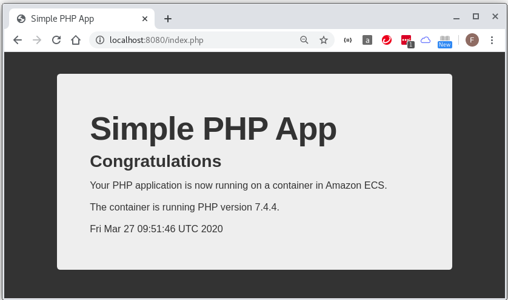
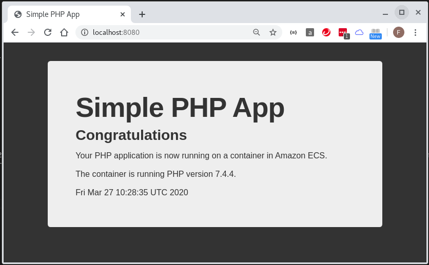

## create `docker-init.sh`
> Note: this script will run after container launched, but before start apache web server.    
> Note: this script can be used to complete any onetime off tasks before start apache webserver, such as migrate database, configure php application.

This `docker-init.sh` get the time when launch this container, save the time to `/var/www/my-vol/date` and then display this time on webpage.

```
[fli@192-168-1-4 easy-php-app]$ cat docker-init.sh 
#!/bin/bash

set -e

mkdir -p /var/www/my-vol
echo `date` > /var/www/my-vol/date
[fli@192-168-1-4 easy-php-app]$ 
```

## update `Dockerfile`

```
[fli@192-168-1-4 easy-php-app]$ cat Dockerfile 
FROM php:7.4-apache

# Copy docker-init.sh into container
COPY docker-init.sh /

# Install app
ADD src /var/www/html
[fli@192-168-1-4 easy-php-app]$ 
```

## create `docker-compose.yml` to test it

```
[fli@192-168-1-4 easy-php-app]$ cat docker-compose.yml 
version: '3.4'
services:
  webserver:
    build: .
    container_name: 'webserver'
    restart: 'always'
    ports:
      - "8080:80"
      - "443:443"
    volumes:
      - ${PWD}/src:/var/www/html
    command:
      - bash
      - -c
      - |
        set -e
        echo 'running prestart script'
        /docker-init.sh
        echo 'initialization done, starting apache'
        exec /usr/sbin/apache2ctl -D FOREGROUND
[fli@192-168-1-4 easy-php-app]$ 
```

## run it
```
[fli@192-168-1-4 easy-php-app]$ docker-compose up -d --build
Creating network "easy-php-app_default" with the default driver
Building webserver
Step 1/3 : FROM php:7.4-apache
 ---> d9ac5626debe
Step 2/3 : COPY docker-init.sh /
 ---> f12f5ddd114e
Step 3/3 : ADD src /var/www/html
 ---> 6cac8d244a32

Successfully built 6cac8d244a32
Successfully tagged easy-php-app_webserver:latest
Creating webserver ... done
[fli@192-168-1-4 easy-php-app]$ docker container ls
CONTAINER ID        IMAGE                    COMMAND                  CREATED             STATUS              PORTS                                        NAMES
759e25203a24        easy-php-app_webserver   "docker-php-entrypoi…"   10 seconds ago      Up 8 seconds        0.0.0.0:443->443/tcp, 0.0.0.0:8080->80/tcp   webserver
[fli@192-168-1-4 easy-php-app]$ docker logs 759
running prestart script
initialization done, starting apache
AH00558: apache2: Could not reliably determine the server's fully qualified domain name, using 192.168.176.2. Set the 'ServerName' directive globally to suppress this message
AH00558: apache2: Could not reliably determine the server's fully qualified domain name, using 192.168.176.2. Set the 'ServerName' directive globally to suppress this message
[Fri Mar 27 09:51:46.677417 2020] [mpm_prefork:notice] [pid 10] AH00163: Apache/2.4.38 (Debian) PHP/7.4.4 configured -- resuming normal operations
[Fri Mar 27 09:51:46.677494 2020] [core:notice] [pid 10] AH00094: Command line: '/usr/sbin/apache2 -D FOREGROUND'
[fli@192-168-1-4 easy-php-app]$ docker exec -it 759 bash
root@759e25203a24:/var/www/html# cat ../my-vol/date 
Fri Mar 27 09:51:46 UTC 2020
root@759e25203a24:/var/www/html# exit
exit
[fli@192-168-1-4 easy-php-app]$ 
```

## test from browser

* Notice the `date` showed in the webpage is exactly the same as what you have seen in the file `/var/www/html/my-vol/date` inside the container.
 



* Double check container logs again

```
[fli@192-168-1-4 easy-php-app]$ docker logs 759
running prestart script
initialization done, starting apache
AH00558: apache2: Could not reliably determine the server's fully qualified domain name, using 192.168.176.2. Set the 'ServerName' directive globally to suppress this message
AH00558: apache2: Could not reliably determine the server's fully qualified domain name, using 192.168.176.2. Set the 'ServerName' directive globally to suppress this message
[Fri Mar 27 09:51:46.677417 2020] [mpm_prefork:notice] [pid 10] AH00163: Apache/2.4.38 (Debian) PHP/7.4.4 configured -- resuming normal operations
[Fri Mar 27 09:51:46.677494 2020] [core:notice] [pid 10] AH00094: Command line: '/usr/sbin/apache2 -D FOREGROUND'
192.168.176.1 - - [27/Mar/2020:09:52:08 +0000] "GET /index.php HTTP/1.1" 200 866 "-" "Mozilla/5.0 (X11; Linux x86_64) AppleWebKit/537.36 (KHTML, like Gecko) Chrome/80.0.3987.132 Safari/537.36"
[fli@192-168-1-4 easy-php-app]$ 
```

## clean up

```
[fli@192-168-1-4 easy-php-app]$ docker-compose down
Stopping webserver ... done
Removing webserver ... done
Removing network easy-php-app_default
[fli@192-168-1-4 easy-php-app]$ 
```

## test CI build again

```
[fli@192-168-1-4 easy-php-app]$ docker run -d --rm -p 8080:80 692083082426.dkr.ecr.ap-southeast-2.amazonaws.com/easy-php-app:9bc1c034b580a8a4af37d8da4ed6979a5e1aa900 /bin/bash -c "set -e; echo 'running prestart script'; /docker-init.sh; echo 'initialization done, starting apache'; exec /usr/sbin/apache2ctl -D FOREGROUND"
abad839dc245d4459c1338bb3a4c1ef6d12a55e9d45102abe886e18f31205ffc
[fli@192-168-1-4 easy-php-app]$ docker container ls
CONTAINER ID        IMAGE                                                                                                     COMMAND                  CREATED             STATUS              PORTS                  NAMES
abad839dc245        692083082426.dkr.ecr.ap-southeast-2.amazonaws.com/easy-php-app:9bc1c034b580a8a4af37d8da4ed6979a5e1aa900   "docker-php-entrypoi…"   14 seconds ago      Up 13 seconds       0.0.0.0:8080->80/tcp   nice_meninsky
[fli@192-168-1-4 easy-php-app]$ 
```



```
[fli@192-168-1-4 easy-php-app]$ docker logs aba
running prestart script
initialization done, starting apache
AH00558: apache2: Could not reliably determine the server's fully qualified domain name, using 172.17.0.2. Set the 'ServerName' directive globally to suppress this message
AH00558: apache2: Could not reliably determine the server's fully qualified domain name, using 172.17.0.2. Set the 'ServerName' directive globally to suppress this message
[Fri Mar 27 10:28:35.770481 2020] [mpm_prefork:notice] [pid 10] AH00163: Apache/2.4.38 (Debian) PHP/7.4.4 configured -- resuming normal operations
[Fri Mar 27 10:28:35.770561 2020] [core:notice] [pid 10] AH00094: Command line: '/usr/sbin/apache2 -D FOREGROUND'
172.17.0.1 - - [27/Mar/2020:10:29:01 +0000] "GET / HTTP/1.1" 200 866 "-" "Mozilla/5.0 (X11; Linux x86_64) AppleWebKit/537.36 (KHTML, like Gecko) Chrome/80.0.3987.132 Safari/537.36"
[fli@192-168-1-4 easy-php-app]$ 

[fli@192-168-1-4 easy-php-app]$ docker exec -it aba cat /var/www/my-vol/date
Fri Mar 27 10:28:35 UTC 2020
[fli@192-168-1-4 easy-php-app]$ 
```


