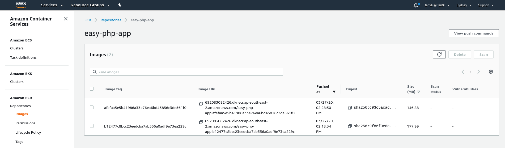
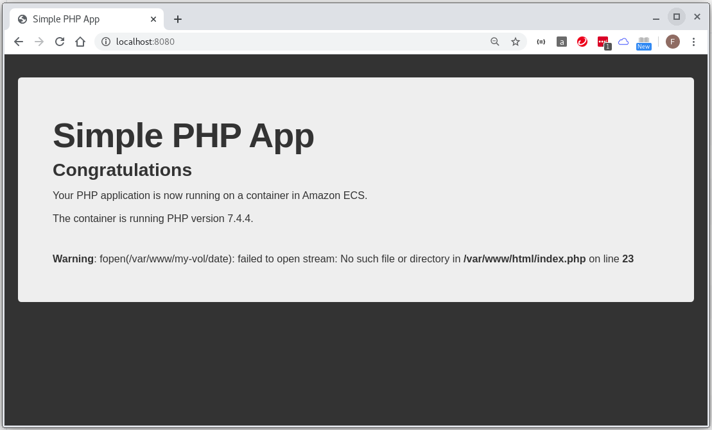

## create new workflow on `feature` branch

```
[fli@192-168-1-4 easy-php-app]$ cat .github/workflows/build-feature.yml 
name: Provision moodle ecs infrastructure to dev environment

on: 
  push:
    branches:
    - feature

jobs:
  build:
    name: build dev environment 
    runs-on: ubuntu-latest

    steps:
    - name: Checkout Repository
      uses: actions/checkout@v2
    - name: Configure AWS credentials
      uses: aws-actions/configure-aws-credentials@v1
      with:
        aws-access-key-id: ${{ secrets.AWS_ACCESS_KEY_ID }}
        aws-secret-access-key: ${{ secrets.AWS_SECRET_ACCESS_KEY }}
        aws-region: ap-southeast-2
    - name: prepare easy-php-app docker image
      run: |
        pwd
        ls -l
        docker build -t easy-php-app .
        docker images
    - name: Login to Amazon ECR
      id: login-ecr
      uses: aws-actions/amazon-ecr-login@v1
    - name: Build, tag, and push image to Amazon ECR
      env:
        ECR_REGISTRY: ${{ steps.login-ecr.outputs.registry }}
        ECR_REPOSITORY: easy-php-app
        IMAGE_TAG: ${{ github.sha }}
      run: |
        docker build -t $ECR_REGISTRY/$ECR_REPOSITORY:$IMAGE_TAG .
        docker push $ECR_REGISTRY/$ECR_REPOSITORY:$IMAGE_TAG
    - name: Logout of Amazon ECR
      if: always()
      run: docker logout ${{ steps.login-ecr.outputs.registry }}
[fli@192-168-1-4 easy-php-app]$ 
```

## create new `Dockerfile`

```
[fli@192-168-1-4 easy-php-app]$ cat Dockerfile 
FROM php:7.4-apache

# Install app
ADD src /var/www/html
[fli@192-168-1-4 easy-php-app]$ 
```

## get the new docker image



```
692083082426.dkr.ecr.ap-southeast-2.amazonaws.com/easy-php-app:afefaa5e5b41986a33e76ea6bd45836c3de561f0
```

## run container and test it in browser

```
[fli@192-168-1-4 ~]$ docker run -d --rm -p 8080:80 692083082426.dkr.ecr.ap-southeast-2.amazonaws.com/easy-php-app:afefaa5e5b41986a33e76ea6bd45836c3de561f0
Unable to find image '692083082426.dkr.ecr.ap-southeast-2.amazonaws.com/easy-php-app:afefaa5e5b41986a33e76ea6bd45836c3de561f0' locally
afefaa5e5b41986a33e76ea6bd45836c3de561f0: Pulling from easy-php-app
68ced04f60ab: Already exists 
1d2a5d8fa585: Already exists 
5d59ec4ae241: Already exists 
d42331ef4d44: Already exists 
408b7b7ee112: Already exists 
570cd47896d5: Already exists 
2419413b2a16: Already exists 
8515d21953c8: Already exists 
e307b7ebcc6a: Already exists 
61ed8a3aafe7: Already exists 
b59ff5b10ec9: Already exists 
cb07323f317f: Already exists 
59d7cb052876: Already exists 
c92114bb8897: Pull complete 
Digest: sha256:c93c5acad5f9e165e14c848129237690c4ea9de7f5f89e798b7110dc8c35447b
Status: Downloaded newer image for 692083082426.dkr.ecr.ap-southeast-2.amazonaws.com/easy-php-app:afefaa5e5b41986a33e76ea6bd45836c3de561f0
ce63c4e9b2293f0285137cb323a19110cb03e2cba6705113d9a611cb12df69fc
[fli@192-168-1-4 ~]$ 

[fli@192-168-1-4 ~]$ docker container ls
CONTAINER ID        IMAGE                                                                                                     COMMAND                  CREATED             STATUS              PORTS                  NAMES
ce63c4e9b229        692083082426.dkr.ecr.ap-southeast-2.amazonaws.com/easy-php-app:afefaa5e5b41986a33e76ea6bd45836c3de561f0   "docker-php-entrypoi…"   10 minutes ago      Up 10 minutes       0.0.0.0:8080->80/tcp   reverent_keller
[fli@192-168-1-4 ~]$ 
```



> Note: The container is running PHP version 7.4.4. 